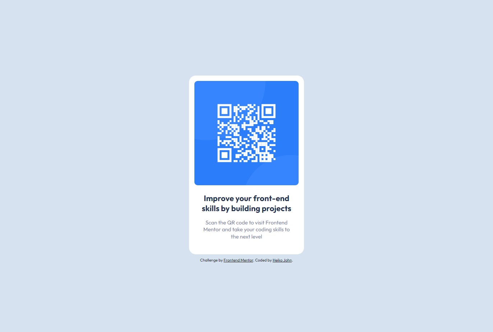

# Frontend Mentor - QR code component solution

This is my solution to the [QR code component challenge on Frontend Mentor](https://www.frontendmentor.io/challenges/qr-code-component-iux_sIO_H).

## Table of contents

- [Overview](#overview)
  - [Screenshot](#screenshot)
  - [Links](#links)
- [My process](#my-process)
  - [Built with](#built-with)
  - [What I learned](#what-i-learned)
  - [Continued development](#continued-development)
  - [Useful resources](#useful-resources)
- [Author](#author)

## Overview

### Screenshot



### Links

- Solution URL: [Add solution URL here](https://your-solution-url.com)
- Live Site URL: [Add live site URL here](https://your-live-site-url.com)

## My process

### Built with

- Semantic HTML5 markup
- CSS custom properties
- BEM methodology

### What I learned

I learned something about the BEM methodology in order to create reusable components.
BEM is an acronym for Block, Element and Modifier and defines elements for a name of a css class.
A Block is a standalone entity like a _header_ or _menu_. An Element is part of an entity like a
_menu item_ or _header title_. A modifier is a flag on a block or element which can be used to change
their appearance or behavior like _disabled_ or _checked_.

This helps for the naming convention of a component like the QR code component:

```html
<div class="qr-code-box">
  
  <div class="qr-code-box__content">
    <h3 class="qr-code-box__content-headline">
      Improve your front-end skills by building projects
    </h3>
    <p class="qr-code-box__content-text">
      Scan the QR code to visit Frontend Mentor and take your coding skills to
      the next level
    </p>
  </div>
</div>
```

```css
.qr-code-box {
  width: 320px;
  padding: 1em;
  background-color: var(--clr-qr-code-box);
  border-radius: 19px;
}

.qr-code-box__image {
  border-radius: 9px;
}

.qr-code-box__content {
  text-align: center;
}

.qr-code-box__content-headline {
  color: var(--clr-qr-code-headline);
  margin-block-start: 1em;
  line-height: 1.3;
  font-size: 1.375rem;
  font-weight: 600;
}

.qr-code-box__content-text {
  color: var(--clr-qr-code-text);
  font-size: 0.938rem;
  font-weight: 400;
  margin-block-start: 1em;
  margin-block-end: 1.625em;
  padding: 0 1.5em;
  line-height: 1.3;
}
```

### Continued development

Using a preprocessor for css like sass might be the next step for a least bigger projects.

### Useful resources

- [A (more) Modern CSS Reset](https://piccalil.li/blog/a-more-modern-css-reset/) - This article by **Andy Bell** helped me to reset websites for browser.
- [BEM](https://getbem.com/) - Concept of the BEM methodology is explained on this site.
- [Google Fonts](https://fonts.google.com/specimen/Outfit) - Font _Outfit_ used
- [PX to REM Calculator](https://nekocalc.com/de/px-zu-rem-umrechner) - Nice tool to convert _px_ to _rem_ and vice versa.
- [PX to EM Calculator](https://nekocalc.com/de/px-zu-em-umrechner) - Nice tool to convert _px_ to _em_ and vice versa.

## Author

- Frontend Mentor - [@daHatta](https://www.frontendmentor.io/profile/daHatta)
